# Document Context Retrieval System

An enterprise-grade, highly grounded, and medically compliant **Document Context Retrieval System**. This system ingests PDF documents, processes and embeds their contents into a secure Pinecone vector database, and utilizes a Large Language Model (LLM) strictly as a retrieval and synthesis engine. 

Designed for high-trust environments (like healthcare and finance), the system guarantees **zero hallucination** by strictly grounding its answers in the source PDFs, backed by automated evaluation scores (Ragas) and robust compliance controls.

---

## 1. System Architecture & Core Flow

The system employs a strict Retrieval-Augmented Generation (RAG) architecture to ensure data integrity and compliance:

```mermaid
graph TD
    A[User PDF Upload] --> B[Data Ingestion Pipeline]
    B --> C[Text Chunking & Tokenization]
    C --> D[Embedding Generator <br/>llama-text-embed-v2]
    D --> E[(Pinecone Vector DB)]
    
    F[User Question] --> G[Strict Grounding Prompt Engine]
    G --> H[Vector Similarity Search]
    H --> E
    E -->|Retrieve Context + Page Citations| I[LLM Synthesis Engine]
    I -->|Synthesized Response with Page Links| J[User Chat Interface]
    
    style E fill:#0f172a,stroke:#3b82f6,stroke-width:2px;
    style I fill:#0f172a,stroke:#a855f7,stroke-width:2px;
```

### Core Components
1. **Ingestion & Text Processing:** Parses PDF files, extracts structural elements, and splits text into semantic chunks with overlapping boundaries to preserve context.
2. **Vector Database (Pinecone):** Stores vector embeddings generated from text chunks. Employs metadata tagging (e.g., `document_id`, `page_number`, `tenant_id`) for precise filtering.
3. **Retrieval Engine:** Performs Cosine Similarity search to pull the top-$k$ most relevant context blocks matching the user's query.
4. **Strict Prompt Grounding:** Restricts LLM capabilities using system prompts, forcing it to reject any world knowledge and only answer from the retrieved chunks.

---

## 2. User Interface & Walkthrough

The following walkthrough outlines the design aesthetics and user interaction flows:

### Step 1: Initial Dashboard UI
A premium, dark-mode dashboard with a clean drag-and-drop container for uploading new PDF sources.

### Step 2: Document Processing & Summary
Once a document (e.g., `Q4_Report_Draft.pdf`) is uploaded, it is embedded in Pinecone. The system extracts key topics and suggests relevant starter questions.

### Step 3: Source-Grounded Q&A Flow
The user can chat with their documents. All answers are generated with precise inline page-number citations.

### Step 4: Strict Grounding (Anti-Hallucination)
The AI system rejects external assumptions. Even if asked general knowledge or counter-factual questions (e.g., `2+2=5`), it only reports what the document explicitly states.

---

## 3. Evaluation & Scoring System (Ragas Framework)

To guarantee the reliability of the retriever and synthesis engine, I integrate **Ragas** (Retrieval Augmented Generation Assessment) directly into my CI/CD pipeline.

### Key Evaluation Metrics

| Metric | Goal | Description | Target Score |
| :--- | :--- | :--- | :--- |
| **Faithfulness** | Anti-Hallucination | Measures if the generated answer is derived *strictly* from the retrieved context. | `> 0.95` |
| **Answer Relevance** | User Experience | Measures if the generated answer directly addresses the user's query. | `> 0.90` |
| **Context Recall** | Retriever Quality | Measures the retriever's ability to fetch all necessary information from the PDF. | `> 0.90` |
| **Context Precision** | Search Efficiency | Measures if the retrieved chunks are ranked correctly by relevance. | `> 0.90` |

### How It Works Programmatically
1. **Evaluation Dataset:** A synthetic dataset of Question-Context-Ground_Truth triplets is generated from the uploaded PDFs.
2. **Automated Run:** During every deployment, a test suite is executed using `ragas` to score current model outputs.
3. **Guardrails:** If the Faithfulness score drops below `0.95`, the build fails automatically, preventing hallucinating models from reaching production.

---

## 4. Strict Grounding & Fallback Queries

I enforce a **Strict Grounding Contract**. Below is the live query history demonstrating how the system answers, falls back, and cites sources:

*   **Q1: What evidence does the document provide about the growth of digital finance?**
    *   **AI:** Global financial account ownership increased from 51% in 2011 to 76% in 2021. `[Source: Brief-Summary.pdf, Page 1]`
*   **Q2: What does the document say about the CEO's favorite book?**
    *   **AI:** I am sorry, but the provided document does not contain any information about this topic. *(Hallucination Block)*
*   **Q3: What risks should regulators consider with fintech adoption?**
    *   **AI:** Regulators should monitor consumer exposure risks, market concentration, and financial stability threats. `[Source: Brief-Summary.pdf, Page 1-2]`
*   **Q4: What percentage of adults had a financial account in 2021 according to the document?**
    *   **AI:** Global account ownership grew to 76% in 2021. `[Source: Brief-Summary.pdf, Page 1]`

---

## 5. Compliance & Security Framework (HIPAA & SOC 2)

To ensure this system is safe for highly regulated industries (like healthcare and finance), my architecture includes standard compliance and security features:

*   **HIPAA Compliance (Healthcare Data Protection):**
    *   **What it does:** It automatically removes or masks patient-identifiable information (PHI) before documents are processed, encrypts files at rest using AES-256, and ensures all API connections are fully encrypted.
    *   **Why it matters:** It keeps patient health records private, secure, and fully compliant with medical data regulations.
*   **SOC 2 Compliance (Security and Data Isolation):**
    *   **What it does:** It isolates user documents using Row-Level Security (meaning different users or organizations can never access each other's data) and runs the entire application inside a secure Virtual Private Cloud (VPC).
    *   **Why it matters:** It guarantees that your business data is completely segregated, monitored, and protected from unauthorized access.

---

## 6. Future Scalability Architecture

To support bursts of concurrent traffic (e.g., 50+ simultaneous users) without hitting provider rate limits or system slowdowns, I have planned three direct scalability strategies that can be layered on top of this architecture:

### 1. API Key Rotation (Handling Provider Rate Limits)
* **How it works:** Instead of relying on a single API key, my system can maintain a pool of multiple API keys.
* **Why it helps:** Most LLM providers restrict requests per minute (RPM). By dynamically rotating through a pool of keys, the application multiplies its effective limits, ensuring that concurrent requests from different users do not cause API throttling.

### 2. Smart LLM Gateways (Load Balancing & Failover)
* **How it works:** I can route all model requests (embeddings and synthesis) through an LLM gateway (like LiteLLM). The gateway load-balances requests across different keys, regions, or even different model providers (Gemini, OpenAI, Anthropic, etc.).
* **Why it helps:** If a primary key or region gets throttled, the gateway automatically handles retries with exponential backoff and fails over to another active key or provider instantly, guaranteeing zero downtime.

### 3. Horizontal Scaling & Asynchronous Queuing (Smoothing Traffic Spikes)
* **How it works:** I can decouple the web interface from the heavy retrieval/generation engine. Incoming questions are placed into a lightweight queue (e.g., Redis Queue or Celery), which are then picked up and processed by multiple parallel workers.
* **Why it helps:** Instead of the system being overwhelmed by sudden traffic spikes, requests are organized in a queue and processed smoothly. I can scale the number of background workers up or down dynamically depending on active usage.

---

## 7. Advanced Agentic Features (Recent Additions)

To elevate the application from a simple Q&A tool to a robust AI Agent, several advanced features were integrated into the architecture:

### 1. Agent Orchestrator
*   **What it does:** Uses LLM function-calling to route user queries to the most appropriate tool (e.g., standard document retrieval, generating a full-document summary, or checking available documents).
*   **Why it matters:** It gives the AI autonomy to choose the best strategy for answering complex or ambiguous requests, rather than relying on a rigid, single-path execution.

### 2. Comprehensive Audit Logs
*   **What it does:** Automatically scores every generated answer in the background (evaluating Faithfulness, Relevance, and Recall) and logs the query, source citations, and scores into a persistent SQLite database.
*   **Why it matters:** Provides a transparent audit trail of what users are asking and exactly how the AI is responding, which is critical for compliance and trust.

### 3. Knowledge Base Explorer (Semantic Caching)
*   **What it does:** Classifies incoming queries by pattern (e.g., "summarize", "key risks") and caches high-quality, highly faithful answers. Admins can "Freeze" these canonical answers.
*   **Why it matters:** Serves repeated or common questions instantly from the cache, drastically reducing LLM token costs and response times while guaranteeing consistency.

### 4. Performance Dashboard
*   **What it does:** A real-time, read-only analytics dashboard aggregating data from the audit logs. It visualizes average evaluation scores, error rates, and query volume across the entire system and broken down per document.
*   **Why it matters:** Allows administrators to monitor system health and pinpoint exactly which documents are causing poor or flagged AI responses at a glance.
